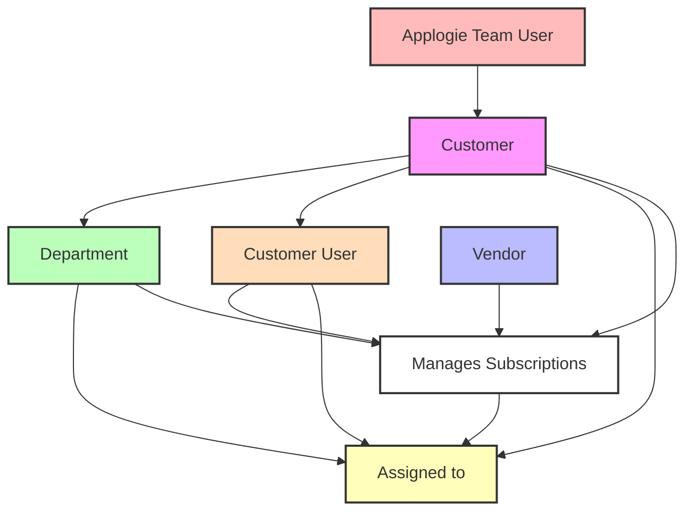

# Applogie Product Glossary

This document defines the key terms used throughout the Applogie product documentation and establishes their relationships to each other.

## Core Terms

### Customer
- **Definition**: An organization that uses Applogie to manage their software subscriptions and spending.
- **Relationships**:
  - Has many **Departments**
  - Has many **Users**
  - Manages many **Subscriptions**
  - Interacts with multiple **Vendors**

### Vendor
- **Definition**: A software company or service provider that supplies subscription-based products or services to the Customer.
- **Relationships**:
  - Provides one or more **Subscriptions**
  - Can serve multiple **Customers**
  - May have different pricing tiers or plans within each **Subscription**

### Subscription
- **Definition**: A software license or service agreement between a Customer and a Vendor, typically with recurring payments.
- **Relationships**:
  - Belongs to one **Customer**
  - Provided by one **Vendor**
  - Can be assigned to one or more **Departments**
  - Has one or more authorized **Users**
- **Attributes**:
  - Start date
  - Renewal date
  - Cost
  - License count/seats
  - Payment frequency (monthly, annual, etc.)

### Department
- **Definition**: An organizational unit within a Customer's organization that uses or manages specific subscriptions.
- **Relationships**:
  - Belongs to one **Customer**
  - Has multiple **Users**
  - Can be assigned multiple **Subscriptions**
  - May have sub-departments (hierarchical structure)
- **Attributes**:
  - Budget allocation
  - Cost center information
  - Department head/manager

### Agreement
- **Definition**: A formal document that outlines the terms, conditions, and details of a subscription between a Customer and a Vendor.
- **Relationships**:
  - Belongs to one **Subscription**
  - Involves one **Customer** and one **Vendor**
  - May be managed by **Department Subscription Owner**
  - Reviewed by **Enterprise Finance Manager**
- **Attributes**:
  - Contract terms
  - Pricing details
  - Service level agreements (SLAs)
  - Renewal terms
  - Special conditions or amendments

### Budget Forecast
- **Definition**: A projected financial plan for subscription costs over multiple years.
- **Relationships**:
  - Associated with **Customer**
  - Broken down by **Department**
  - Includes multiple **Subscriptions**
- **Attributes**:
  - Current year budget
  - Future year projections
  - Historical cost data
  - Growth assumptions
  - Renewal impact

### Document Repository
- **Definition**: A centralized storage system for all subscription-related documentation.
- **Components**:
  - Agreements
  - Invoices
  - Technical documentation
  - Integration guides
- **Features**:
  - Multi-channel submission (direct upload, email)
  - Automatic categorization
  - Version control
  - Access controls

## Users

### Applogie Team User
- **Definition**: An individual who is part of the Applogie team and has access to customer instances for support and administration.
- **Relationships**:
  - Can access multiple **Customer** instances
  - Manages **Customer Users** and their roles

#### Applogie Team User Roles
- **Super User**:
  - God-level access to all data across all customers
- **Support User**:
  - Access to specific customer instances as needed for support
  - Can view and modify customer data with appropriate permissions

### Customer User
- **Definition**: An individual who has login credentials and uses the Applogie platform to manage, monitor, or administer subscriptions and related tasks for their own company.
- **Relationships**:
  - Belongs to one **Customer**
  - Can be Enterprise-level or Department-level
  - Can manage multiple **Subscriptions** (based on scope)
  - Can manage multiple **License Users** (based on scope)

#### Enterprise-Level Roles
Users with visibility and access across all departments:
- **System Administrator**:
  - Full system configuration access
  - Manages all departments and users
  - Complete subscription oversight
  - User and role management

- **Enterprise Finance Manager**:
  - Cross-department financial oversight
  - Company-wide cost analysis
  - Budget management across departments
  - Enterprise-level reporting

- **Enterprise Subscription Manager**:
  - Cross-department subscription management
  - License allocation across departments
  - Vendor relationship management
  - Enterprise-wide compliance monitoring

- **Enterprise Technical Subscription Owner**:
  - Manages the technical aspects of all subscriptions across the enterprise.
  - Responsibilities include integration setup, access configuration, and technical documentation.

#### Department-Level Roles
Users with visibility and access limited to their assigned department(s):
- **Department Manager**:
  - Manages department subscriptions
  - Oversees department license users
  - Department-level reporting
  - Budget tracking for department

- **Department Finance Analyst**:
  - Department cost tracking
  - Subscription usage analysis
  - Department budget management
  - Department-specific reporting

- **Department Subscription Owner**:
  - Manages specific subscriptions
  - License user assignment
  - Usage monitoring
  - Renewal management

- **Department Technical Subscription Owner**:
  - Manages the technical aspects of subscriptions assigned to their specific department.
  - Responsibilities include integration setup, access configuration, and technical documentation for their department's subscriptions.

- **Department Read-Only User**:
  - Views department subscriptions
  - Access to department reports
  - No modification privileges

### License User
- **Definition**: An individual within the Customer organization who uses or is assigned to one or more software subscriptions, but may not necessarily have access to the Applogie platform.
- **Relationships**:
  - Belongs to one **Customer**
  - Can belong to one or more **Departments**
  - Can be assigned to multiple **Subscriptions**
  - May or may not be a **Customer User**
- **Attributes**:
  - License assignments
  - Usage data
  - Department affiliation
  - Employee status (active/inactive)

## Hierarchy

## Additional Context

### Role-Based Access and Scope

#### Enterprise-Level Access
Users with enterprise-level roles have broad, cross-departmental access:

- **System Administrator Capabilities**:
  - Configure system-wide settings and integrations
  - Manage all Applogie users and role assignments
  - Create and manage department structures
  - Access all subscription and license data
  - Configure enterprise-wide policies
  - Manage authentication and security settings

- **Enterprise Finance Manager Capabilities**:
  - View and analyze costs across all departments
  - Manage enterprise-wide budgets
  - Configure cost allocation rules
  - Generate enterprise-level financial reports
  - Set up billing integrations
  - Track overall subscription spending

- **Enterprise Subscription Manager Capabilities**:
  - Manage subscriptions across all departments
  - Oversee license allocation strategies
  - Monitor enterprise-wide compliance
  - Manage vendor relationships
  - Configure subscription policies
  - Track overall subscription utilization

#### Department-Level Access
Users with department-level roles have access limited to their assigned department(s):
- **Department Manager Capabilities**:
  - Manage department-specific settings
  - Assign department-level user roles
  - View and manage department subscriptions
  - Generate department-level reports
  - Track department budget utilization
  - Manage department license assignments

- **Department Finance Analyst Capabilities**:
  - View department-specific costs
  - Track department budget
  - Generate department financial reports
  - Analyze department subscription usage
  - Monitor department spending trends

- **Department Subscription Owner Capabilities**:
  - Manage assigned subscriptions
  - Handle license assignments within department
  - Monitor subscription usage
  - Manage renewal processes
  - Track compliance within department

- **Department Read-Only User Capabilities**:
  - View department subscription details
  - Access department-specific reports
  - View license assignments
  - Monitor usage metrics
  - No modification privileges

#### Access Inheritance and Delegation
- Department-level users cannot access data from other departments
- Enterprise-level users can access and manage all department data
- Department-level users can be granted access to multiple departments if needed
- Enterprise-level users can temporarily delegate specific permissions to department-level users

### Subscription Management
- A subscription can be centrally managed or department-managed
- Subscriptions can be shared across departments
- Usage and costs can be allocated to specific departments

### Department Structure
- Departments can have a hierarchical structure
- Sub-departments inherit certain properties from parent departments
- Cost allocation can be rolled up through the department hierarchy

---

**Note**: This glossary is a living document and will be updated as new terms are added or existing definitions are refined.
