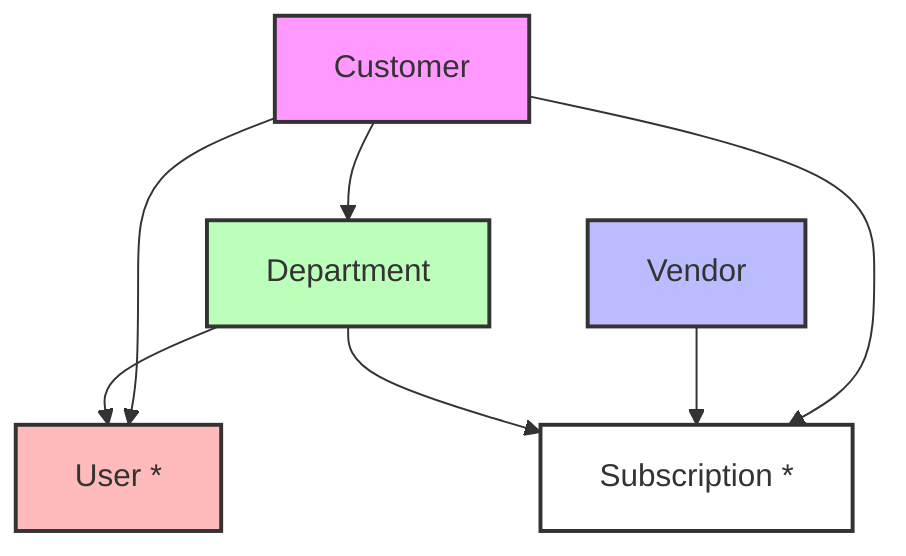

# Applogie Product Glossary

This document defines the key terms used throughout the Applogie product documentation and establishes their relationships to each other.

## Core Terms

### Customer
- **Definition**: An organization that uses Applogie to manage their software subscriptions and spending.
- **Relationships**:
  - Has many **Departments**
  - Has many **Users**
  - Manages many **Subscriptions**
  - Interacts with multiple **Vendors**

### Vendor
- **Definition**: A software company or service provider that supplies subscription-based products or services to the Customer.
- **Relationships**:
  - Provides one or more **Subscriptions**
  - Can serve multiple **Customers**
  - May have different pricing tiers or plans within each **Subscription**

### Subscription
- **Definition**: A software license or service agreement between a Customer and a Vendor, typically with recurring payments.
- **Relationships**:
  - Belongs to one **Customer**
  - Provided by one **Vendor**
  - Can be assigned to one or more **Departments**
  - Has one or more authorized **Users**
- **Attributes**:
  - Start date
  - Renewal date
  - Cost
  - License count/seats
  - Payment frequency (monthly, annual, etc.)

### Department
- **Definition**: An organizational unit within a Customer's organization that uses or manages specific subscriptions.
- **Relationships**:
  - Belongs to one **Customer**
  - Has multiple **Users**
  - Can be assigned multiple **Subscriptions**
  - May have sub-departments (hierarchical structure)
- **Attributes**:
  - Budget allocation
  - Cost center information
  - Department head/manager

### User
- **Definition**: An individual who has access to Applogie and/or uses subscriptions managed through Applogie.
- **Relationships**:
  - Belongs to one **Customer**
  - Can belong to one or more **Departments**
  - Can be assigned to multiple **Subscriptions**
- **Types**:
  - System Administrator
  - Department Manager
  - End User
  - Finance Manager
  - Subscription Owner

## Hierarchy

## Additional Context

### Role-Based Access
Different user types have different levels of access and capabilities within Applogie:
- System Administrators can manage all aspects of the Customer's account
- Department Managers can manage their department's subscriptions and users
- End Users may only have access to assigned subscriptions
- Finance Managers have access to cost and billing information
- Subscription Owners manage specific subscription details and assignments

### Subscription Management
- A subscription can be centrally managed or department-managed
- Subscriptions can be shared across departments
- Usage and costs can be allocated to specific departments

### Department Structure
- Departments can have a hierarchical structure
- Sub-departments inherit certain properties from parent departments
- Cost allocation can be rolled up through the department hierarchy

---

**Note**: This glossary is a living document and will be updated as new terms are added or existing definitions are refined.
