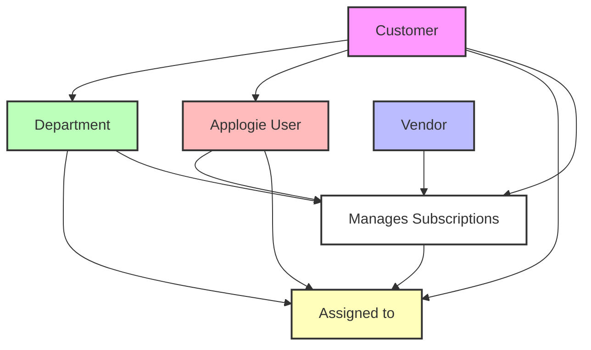

# Applogie Product Glossary

This document defines the key terms used throughout the Applogie product documentation and establishes their relationships to each other.

## Core Terms

### Customer
- **Definition**: An organization that uses Applogie to manage their software subscriptions and spending.
- **Relationships**:
  - Has many **Departments**
  - Has many **Users**
  - Manages many **Subscriptions**
  - Interacts with multiple **Vendors**

### Vendor
- **Definition**: A software company or service provider that supplies subscription-based products or services to the Customer.
- **Relationships**:
  - Provides one or more **Subscriptions**
  - Can serve multiple **Customers**
  - May have different pricing tiers or plans within each **Subscription**

### Subscription
- **Definition**: A software license or service agreement between a Customer and a Vendor, typically with recurring payments.
- **Relationships**:
  - Belongs to one **Customer**
  - Provided by one **Vendor**
  - Can be assigned to one or more **Departments**
  - Has one or more authorized **Users**
- **Attributes**:
  - Start date
  - Renewal date
  - Cost
  - License count/seats
  - Payment frequency (monthly, annual, etc.)

### Department
- **Definition**: An organizational unit within a Customer's organization that uses or manages specific subscriptions.
- **Relationships**:
  - Belongs to one **Customer**
  - Has multiple **Users**
  - Can be assigned multiple **Subscriptions**
  - May have sub-departments (hierarchical structure)
- **Attributes**:
  - Budget allocation
  - Cost center information
  - Department head/manager

### Applogie User
- **Definition**: An individual who has login credentials and uses the Applogie platform to manage, monitor, or administer subscriptions and related tasks.
- **Relationships**:
  - Belongs to one **Customer**
  - Can belong to one or more **Departments**
  - Can manage multiple **Subscriptions**
  - Can manage multiple **License Users**
- **Types**:
  - System Administrator: Manages all aspects of Applogie configuration
  - Department Manager: Manages department-specific subscriptions and users
  - Finance Manager: Monitors and manages costs and billing
  - Subscription Owner: Manages specific subscription details
  - Read-only User: Views subscription and license information

### License User
- **Definition**: An individual within the Customer organization who uses or is assigned to one or more software subscriptions, but may not necessarily have access to the Applogie platform.
- **Relationships**:
  - Belongs to one **Customer**
  - Can belong to one or more **Departments**
  - Can be assigned to multiple **Subscriptions**
  - May or may not be an **Applogie User**
- **Attributes**:
  - License assignments
  - Usage data
  - Department affiliation
  - Employee status (active/inactive)

## Hierarchy

## Additional Context

### Role-Based Access
Access levels and capabilities within Applogie are determined by the Applogie User's role:
- **System Administrators**:
  - Manage all aspects of the Customer's Applogie account
  - Configure system-wide settings
  - Manage other Applogie Users and their roles
  - Full access to all subscription and license management features

- **Department Managers**:
  - Manage their department's subscriptions and License Users
  - View and manage department-specific costs and allocations
  - Generate department-specific reports
  - Limited to their department's scope

- **Finance Managers**:
  - Access to all cost and billing information
  - Generate financial reports
  - Monitor spending across departments
  - View license utilization data

- **Subscription Owners**:
  - Manage specific subscription details
  - Assign and remove License Users
  - Monitor usage and compliance
  - Handle renewal and changes for their subscriptions

- **Read-only Users**:
  - View subscription and license information
  - Generate reports
  - No ability to make changes

### Subscription Management
- A subscription can be centrally managed or department-managed
- Subscriptions can be shared across departments
- Usage and costs can be allocated to specific departments

### Department Structure
- Departments can have a hierarchical structure
- Sub-departments inherit certain properties from parent departments
- Cost allocation can be rolled up through the department hierarchy

---

**Note**: This glossary is a living document and will be updated as new terms are added or existing definitions are refined.
